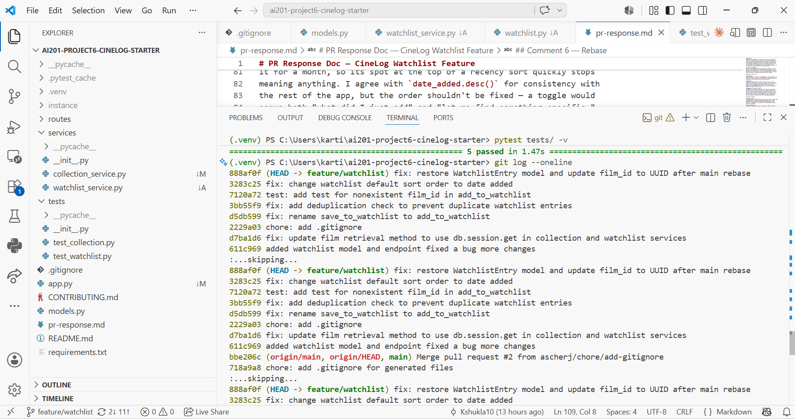

# PR Response Doc — CineLog Watchlist Feature

## AI Usage
I used AI tools in a few specific ways during this project:
- **Orientation:** Before touching any code, I used AI to help summarize
  `add_to_collection()` in `services/collection_service.py` — specifically
  what its deduplication check does and what it returns when a duplicate is
  detected — before writing the equivalent check in `add_to_watchlist()`
  myself for Comment 2.
- **Design stress-testing (Comments 4 and 5):** I wrote my own position and
  reasoning for both comments first, then asked AI what counterargument a
  careful reviewer might raise. For Comment 4, this surfaced the point that
  most users never change default settings, which sharpened my "tradeoff
  acknowledged" section — I hadn't originally framed the risk in those
  terms. For Comment 5, the AI's pushback mostly confirmed reasoning I'd
  already included (the "utility buffer vs. history log" distinction), so I
  kept my draft largely as-is.
- **Rebase mechanics:** I used AI to walk through the mechanics of
  `git rebase -i` (reword vs. fixup, resolving conflicts, vim editing
  commands) since I hadn't used interactive rebase before. The actual
  conflict resolution — restoring the `WatchlistEntry` model and updating
  `film_id` to UUID — was based on comparing my branch's `models.py`
  against `main`'s post-refactor version myself.

## Comment 1 — Rename
**What I did:** Renamed `save_to_watchlist()` to `add_to_watchlist()` in
`services/watchlist_service.py` to match the project's `verb_to_noun`
convention used by `add_to_collection()`. Updated the import and call site
in `routes/watchlist/watchlist.py`.
**How I verified:** Searched the project for any remaining references to
`save_to_watchlist` (found none) and confirmed `add_to_watchlist` appears
in exactly the three expected places (definition + import + call site).
Ran the full test suite to confirm nothing broke.

## Comment 2 — Deduplication
**What I did:** Added a dedup check inside `add_to_watchlist()` that queries
for an existing `WatchlistEntry` matching the same `user_id` and `film_id`,
raising a new `AlreadyInWatchlistError` if one is found — mirroring the
pattern in `add_to_collection()`/`AlreadyInCollectionError`.
**How I verified:** Ran the full test suite to confirm nothing broke, and
manually tested via curl that adding the same film twice now returns an
error instead of creating a duplicate row.

## Comment 3 — Missing test
**What I did:** Created `tests/test_watchlist.py` with a test for the
nonexistent-film case, following the same fixture and assertion pattern as
`test_add_to_collection_nonexistent_film_raises` in `test_collection.py`.
Initially used a fake integer film_id (999999), since `Film.id` was still
`db.Integer` at that point in the branch. After the Comment 6 rebase
migrated film IDs to UUIDs, I updated this test to use a UUID-format fake
ID instead, matching the pattern in `test_collection.py`.
**How I verified:** Ran `pytest tests/test_watchlist.py -v` (passed) and
the full suite `pytest tests/ -v` (all 5 tests passing, nothing broken) —
both before and after the Comment 6 rebase update.

## Comment 4 — Default visibility

**My position:**
Watchlist entries should default to `public=True`.

**Reasoning:**
CineLog's core loop depends on discovery, social proof, and shared taste.
A watchlist is aspirational — it answers "what am I planning to watch
next?" — which makes it a natural conversation starter in a community app:
friends can spot overlapping watchlists for movie nights, and users can
draw inspiration from people they follow. A collection (already watched)
and a watchlist (intend to watch) are different kinds of data, but both
drive discovery for CineLog specifically, so both benefit more from
visibility than privacy. Defaulting to private would quietly undercut that
for the majority of users who never touch their settings.

**Tradeoff acknowledged:**
The real cost is that some entries reveal more than intended — a "guilty
pleasure" title added without a second thought about who sees it. Since
most users never change defaults, anyone who'd have preferred privacy is
exposed unless they opt out. The fix isn't a different default, but making
the privacy control impossible to miss — surfaced when adding a film, not
buried in settings — so opting out takes one tap, not a search.

## Comment 5 — Sort order

**My position:**
Switch the default sort order to `date_added.desc()` (most recent first) to
match the maintainer's request and the collection's existing behavior, but
treat this as a starting point — a user-controlled sort toggle (recency vs.
alphabetical) would serve the watchlist better long-term.

**Reasoning:**
A watchlist's ideal order shifts with size. When it's small, recency
answers the immediate question "what did I just add that I want to watch
tonight?" But as it grows into a backlog of dozens of films, recency turns
into a chaotic chronological ledger, and users naturally pivot to
scanning — checking alphabetically whether a film is already saved, or
browsing by title. Recency serves the short-term case well; alphabetical
becomes a real need as the list grows.

**Engagement with reviewer's point:**
The maintainer's reasoning — "most users want to see what they added
recently" — holds for collections, where "most recently watched" reflects
real activity. A watchlist is different: it's a buffer of intent, not a
history log. Someone might add *Citizen Kane* today with no plan to watch
it for a month, so its spot at the top of a recency sort quickly stops
meaning anything. I agree with `date_added.desc()` for consistency with
the rest of the app, but the order shouldn't be fixed — a toggle would
serve both "what did I just add" and "let me find something specific."

## Comment 6 — Rebase

**What conflicted:**
`.gitignore` had a straightforward conflict (both my branch and `main` added
one independently — resolved by merging both sets of entries). The more
significant issue surfaced after the rebase completed: `main`'s UUID
refactor conflict resolution had dropped the `WatchlistEntry` model
entirely from `models.py`, and `Film.id` was now `db.String(36)` (UUID)
instead of `db.Integer`.

**How I resolved it:**
Re-added the `WatchlistEntry` model to `models.py`, updating `film_id` to
`db.String(36)` with a `db.ForeignKey("film.id")` to match the new UUID
type used across `Film` and `CollectionEntry`. Updated the stale docstring
in `add_to_watchlist()` (previously noting `film_id (int)` as a pre-refactor
type) to reflect the UUID string type. Updated
`test_add_to_watchlist_nonexistent_film_raises` to use a UUID-format fake
ID instead of an integer, matching the pattern in `test_collection.py`.

**How I verified no conflict remains:**
Ran `git log --oneline --graph` to confirm a single linear history with no
merge commits. Ran the full test suite (`pytest tests/ -v`) — all tests
pass, confirming the watchlist code is fully consistent with the new UUID
schema.

## PR Description

**What this feature does:**
Adds a watchlist feature so users can save films they want to watch, view
their watchlist, and avoid duplicate entries. `add_to_watchlist()` follows
the naming convention used elsewhere in the app (`add_to_collection()`),
checks that the film exists before adding it, and raises
`AlreadyInWatchlistError` if the film is already on the user's watchlist.

**Design decisions:**
- **Default visibility:** new watchlist entries default to `public=True`,
  supporting CineLog's community/discovery focus. See Comment 4 above for
  the full reasoning and the tradeoff being accepted.
- **Sort order:** `get_watchlist()` now sorts by `date_added` descending
  (most recently added first), matching the maintainer's preference and
  the collection service's existing behavior. See Comment 5 above for the
  full argument, including why a future sort toggle would serve the
  feature better long-term.

**Manual testing steps:**
1. Start the server: `python app.py`
2. Create a user and film (via existing setup/fixture data or directly
   against the database).
3. Add a film to the watchlist:
   `curl -X POST http://127.0.0.1:5000/watchlist/<user_id>/add -H "Content-Type: application/json" -d '{"film_id": "<uuid>"}'`
4. Confirm duplicate prevention by repeating step 3 with the same
   `film_id` — should return an error instead of creating a duplicate
   entry.
5. View the watchlist: `curl http://127.0.0.1:5000/watchlist/<user_id>` —
   confirm results are sorted with the most recently added film first.

**Screenshot:** `git log --oneline` output showing rewritten conventional
commits with no merge commits
